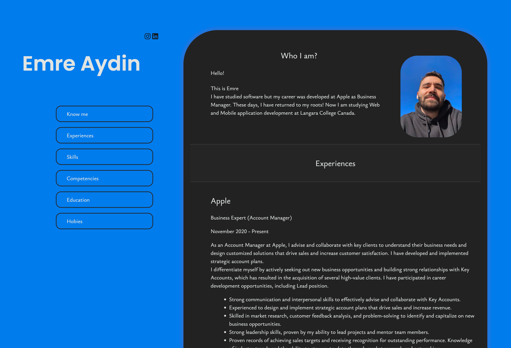
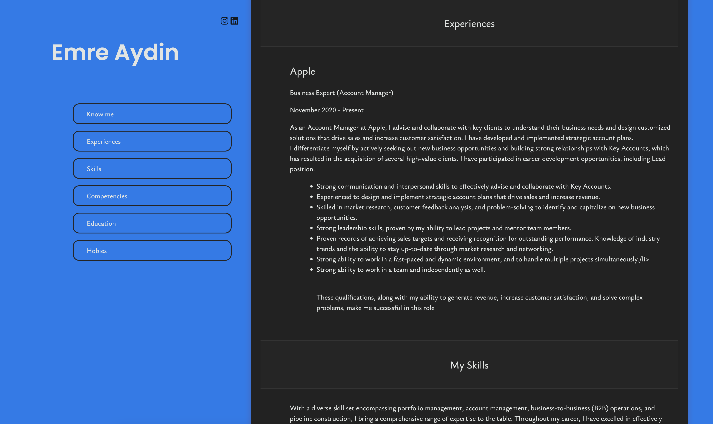

<h1>My Resume Website</h1>
<h4>Hey there! Welcome to my resume website project! I'm Emre Aydin, and I created this website for a school project to showcase my skills and experiences.</h4>

<h2>Languages Used</h2>

- <b>HTML</b> 
- <b>CSS</b>

<h2>Features I Implemented </h2>

- <b>Designed the website to be responsive, so it looks good on all devices</b> 
- <b>Created a navigation menu for easy access to different sections</b>

> [!TIP]
> <h2>How to Run</h2>
> To check out my website, just clone this repository and open the index.html file in your web browser.

<h2>Program walk-through:</h2>

This is a snapshot of the homepage, showcasing my personal information and a brief introduction.:  

  
 
 
Here's another screenshot, showing the experiences section with details about my work at Apple.:   

  
 

